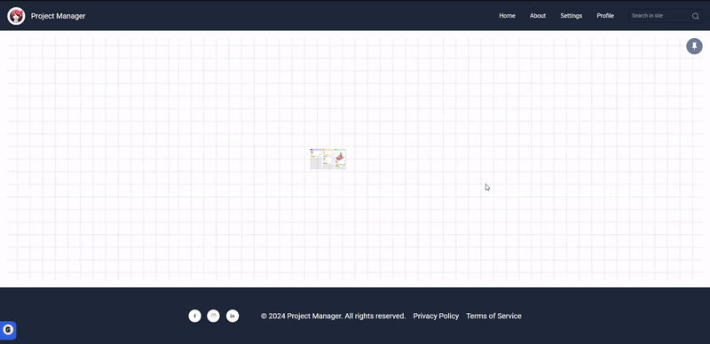

# 🦖 Jurassic challenge 2 - Project Manager

This project aims to develop an interactive and responsive web application based on Kanban principles, enabling efficient task and user manageme

## :camera: Preview

## :hammer: Features

<ul>
  <li><strong>Task Management</strong>
    <ul>
      <li>Create, edit, and delete tasks.</li>
      <li>Organize tasks into columns (e.g., "To Do", "In Progress", "Done").</li>
    </ul>
  </li>
  <li><strong>User Management</strong>
    <ul>
      <li>Assign tasks to users.</li>
      <li>Permission control.</li>
    </ul>
  </li>
  <li><strong>Responsive Interface</strong>
    <ul>
      <li>Drag and drop tasks.</li>
      <li>Design optimized for mobile devices.</li>
    </ul>
  </li>
  <li><strong>Real-Time Collaboration</strong>
    <ul>
      <li>Instant updates.</li>
      <li>Task comments.</li>
    </ul>
  </li>
</ul>

## 🛠 Technologies

✔️ HTML  
✔️ Typescript  
✔️ React  
✔️ Tailwind  
✔️ Clerk  
✔️ React Router  
✔️ JSON Server  

## :gear: Setup

1. `git clone https://github.com/tretake/Desafio-2---Semana-08---JURASSIC.git` to clone
2. Create a [Clerk](https://clerk.com/) account
3. Create file at the root of the project .env.local and paste your VITE_CLERK_PUBLISHABLE_KEY
4. npm install
5. npm run dev

## :man_technologist: Developers - Linkedin

[Caio Cavalcanti](https://www.linkedin.com/in/caiohfcavalcanti/) 
[Décio Francis](https://www.linkedin.com/in/deciofrancis/) 
[Deividson Omédio](https://www.linkedin.com/in/deividson-omedio/) 
[Glauce Duarte](https://www.linkedin.com/in/glauce-da-silva-duarte-98004529/) 
[Jose Tadeu](https://www.linkedin.com/in/jos%C3%A9-tadeu-nascimento/) 
[Ruan Lourenço](https://www.linkedin.com/in/ruan-lourenço/) 
